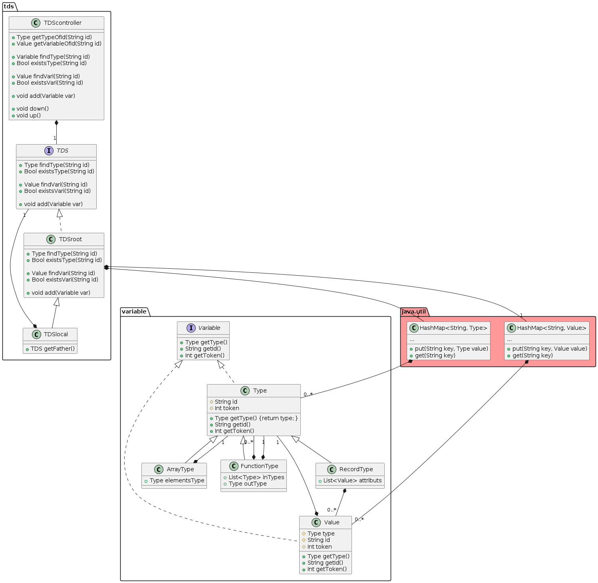

# tdstool

## Conception

### Diagramme de classe

### Fonctionnement

On n'utilise seulement `TDScontroller` et ses méthodes :

- `Variable find(String id)` renvoie la variable de nom `id`
- `Bool exists(String id)` renvoie vrai si la variable de nom `id` existe dans la TDS
- `void add(Variable var)` ajoute la variable `var` à la TDS
- `void down()` rentre dans un bloc
- `void up()` sort d'un bloc

## Tests

La classe `eu.tn.chaoscompiler.tdstool.test` permet de tester la TDS.