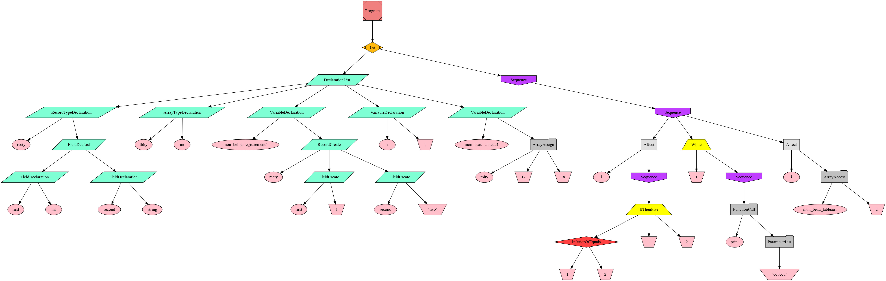

[](https://git.io/typing-svg)

---

# pcl-goureau1u

Projet de Compilation 2022-2023 (PCL1 & PCL2).
Membres du groupe :
- Nicolas Frache (IL)
- Théo Goureau (IL)
- Cyrielle Lacrampe--Diter (IL)
- Rida Moussaoui (ISS)

---
# Technologies utilisées

- Compilateur écrit en **Java** avec un projet **Maven**
- Analyseur LL(*) pour notre grammaire LL1 :  **Antlr4** 
- Langage de destination : **Arm64**

---
# Utilisation de l'application
- Cloner le dépot git
- Executer le fichier [./tigerCompiler.jar]() avec :
``` shell
java -jar ./tigerCompiler.jar
```
Voir la syntaxe:


### optiion --ast
L'option --ast génerera dans la sortie du terminal un lien similaire à [celui-ci](https://nicolas-frache.github.io/GraphvizOnline/#digraph%20%22ast%22%7B%0A%0A%09nodesep%3D1%3B%0A%09ranksep%3D1%3B%0Anode%20%5Bstyle%3Dfilled%5D%0A%09N1%20%5Blabel%3D%22Let%22%2C%20shape%3D%22Mdiamond%22%2C%20fillcolor%3D%22darkgoldenrod1%22%5D%3B%0A%09N2%20%5Blabel%3D%22DeclarationList%22%2C%20shape%3D%22parallelogram%22%2C%20fillcolor%3D%22aquamarine%22%5D%3B%0A%09N3%20%5Blabel%3D%22RecordTypeDeclaration%22%2C%20shape%3D%22parallelogram%22%2C%20fillcolor%3D%22aquamarine%22%5D%3B%0A%09N4%20%5Blabel%3D%22recty%22%2C%20shape%3D%22ellipse%22%2C%20fillcolor%3D%22pink%22%5D%3B%0A%09N5%20%5Blabel%3D%22FieldDecList%22%2C%20shape%3D%22parallelogram%22%2C%20fillcolor%3D%22aquamarine%22%5D%3B%0A%09N6%20%5Blabel%3D%22FieldDeclaration%22%2C%20shape%3D%22parallelogram%22%2C%20fillcolor%3D%22aquamarine%22%5D%3B%0A%09N7%20%5Blabel%3D%22first%22%2C%20shape%3D%22ellipse%22%2C%20fillcolor%3D%22pink%22%5D%3B%0A%09N8%20%5Blabel%3D%22int%22%2C%20shape%3D%22ellipse%22%2C%20fillcolor%3D%22pink%22%5D%3B%0A%09N9%20%5Blabel%3D%22FieldDeclaration%22%2C%20shape%3D%22parallelogram%22%2C%20fillcolor%3D%22aquamarine%22%5D%3B%0A%09N10%20%5Blabel%3D%22second%22%2C%20shape%3D%22ellipse%22%2C%20fillcolor%3D%22pink%22%5D%3B%0A%09N11%20%5Blabel%3D%22string%22%2C%20shape%3D%22ellipse%22%2C%20fillcolor%3D%22pink%22%5D%3B%0A%09N12%20%5Blabel%3D%22ArrayTypeDeclaration%22%2C%20shape%3D%22parallelogram%22%2C%20fillcolor%3D%22aquamarine%22%5D%3B%0A%09N13%20%5Blabel%3D%22tblty%22%2C%20shape%3D%22ellipse%22%2C%20fillcolor%3D%22pink%22%5D%3B%0A%09N14%20%5Blabel%3D%22int%22%2C%20shape%3D%22ellipse%22%2C%20fillcolor%3D%22pink%22%5D%3B%0A%09N15%20%5Blabel%3D%22VariableDeclaration%22%2C%20shape%3D%22parallelogram%22%2C%20fillcolor%3D%22aquamarine%22%5D%3B%0A%09N16%20%5Blabel%3D%22mon_bel_enregistrement4%22%2C%20shape%3D%22ellipse%22%2C%20fillcolor%3D%22pink%22%5D%3B%0A%09N17%20%5Blabel%3D%22RecordCreate%22%2C%20shape%3D%22parallelogram%22%2C%20fillcolor%3D%22aquamarine%22%5D%3B%0A%09N18%20%5Blabel%3D%22recty%22%2C%20shape%3D%22ellipse%22%2C%20fillcolor%3D%22pink%22%5D%3B%0A%09N19%20%5Blabel%3D%22FieldCreate%22%2C%20shape%3D%22parallelogram%22%2C%20fillcolor%3D%22aquamarine%22%5D%3B%0A%09N20%20%5Blabel%3D%22first%22%2C%20shape%3D%22ellipse%22%2C%20fillcolor%3D%22pink%22%5D%3B%0A%09N21%20%5Blabel%3D%221%22%2C%20shape%3D%22invtrapezium%22%2C%20fillcolor%3D%22pink%22%5D%3B%0A%09N22%20%5Blabel%3D%22FieldCreate%22%2C%20shape%3D%22parallelogram%22%2C%20fillcolor%3D%22aquamarine%22%5D%3B%0A%09N23%20%5Blabel%3D%22second%22%2C%20shape%3D%22ellipse%22%2C%20fillcolor%3D%22pink%22%5D%3B%0A%09N24%20%5Blabel%3D%22%5C%22two%5C%22%22%2C%20shape%3D%22invtrapezium%22%2C%20fillcolor%3D%22pink%22%5D%3B%0A%09N25%20%5Blabel%3D%22VariableDeclaration%22%2C%20shape%3D%22parallelogram%22%2C%20fillcolor%3D%22aquamarine%22%5D%3B%0A%09N26%20%5Blabel%3D%22i%22%2C%20shape%3D%22ellipse%22%2C%20fillcolor%3D%22pink%22%5D%3B%0A%09N27%20%5Blabel%3D%221%22%2C%20shape%3D%22invtrapezium%22%2C%20fillcolor%3D%22pink%22%5D%3B%0A%09N28%20%5Blabel%3D%22VariableDeclaration%22%2C%20shape%3D%22parallelogram%22%2C%20fillcolor%3D%22aquamarine%22%5D%3B%0A%09N29%20%5Blabel%3D%22mon_beau_tableau1%22%2C%20shape%3D%22ellipse%22%2C%20fillcolor%3D%22pink%22%5D%3B%0A%09N30%20%5Blabel%3D%22ArrayAssign%22%2C%20shape%3D%22folder%22%2C%20fillcolor%3D%22grey%22%5D%3B%0A%09N31%20%5Blabel%3D%22tblty%22%2C%20shape%3D%22ellipse%22%2C%20fillcolor%3D%22pink%22%5D%3B%0A%09N32%20%5Blabel%3D%2212%22%2C%20shape%3D%22invtrapezium%22%2C%20fillcolor%3D%22pink%22%5D%3B%0A%09N33%20%5Blabel%3D%2218%22%2C%20shape%3D%22invtrapezium%22%2C%20fillcolor%3D%22pink%22%5D%3B%0A%09N34%20%5Blabel%3D%22Sequence%22%2C%20shape%3D%22invhouse%22%2C%20fillcolor%3D%22darkorchid1%22%5D%3B%0A%09N35%20%5Blabel%3D%22Sequence%22%2C%20shape%3D%22invhouse%22%2C%20fillcolor%3D%22darkorchid1%22%5D%3B%0A%09N36%20%5Blabel%3D%22Affect%22%2C%20shape%3D%22rectangle%22%2C%20fillcolor%3D%22gray88%22%5D%3B%0A%09N37%20%5Blabel%3D%22i%22%2C%20shape%3D%22ellipse%22%2C%20fillcolor%3D%22pink%22%5D%3B%0A%09N38%20%5Blabel%3D%22Sequence%22%2C%20shape%3D%22invhouse%22%2C%20fillcolor%3D%22darkorchid1%22%5D%3B%0A%09N39%20%5Blabel%3D%22IfThenElse%22%2C%20shape%3D%22trapezium%22%2C%20fillcolor%3D%22yellow%22%5D%3B%0A%09N40%20%5Blabel%3D%22InferiorOrEquals%22%2C%20shape%3D%22diamond%22%2C%20fillcolor%3D%22brown1%22%5D%3B%0A%09N41%20%5Blabel%3D%221%22%2C%20shape%3D%22invtrapezium%22%2C%20fillcolor%3D%22pink%22%5D%3B%0A%09N42%20%5Blabel%3D%222%22%2C%20shape%3D%22invtrapezium%22%2C%20fillcolor%3D%22pink%22%5D%3B%0A%09N43%20%5Blabel%3D%221%22%2C%20shape%3D%22invtrapezium%22%2C%20fillcolor%3D%22pink%22%5D%3B%0A%09N44%20%5Blabel%3D%222%22%2C%20shape%3D%22invtrapezium%22%2C%20fillcolor%3D%22pink%22%5D%3B%0A%09N45%20%5Blabel%3D%22While%22%2C%20shape%3D%22trapezium%22%2C%20fillcolor%3D%22yellow%22%5D%3B%0A%09N46%20%5Blabel%3D%221%22%2C%20shape%3D%22invtrapezium%22%2C%20fillcolor%3D%22pink%22%5D%3B%0A%09N47%20%5Blabel%3D%22Sequence%22%2C%20shape%3D%22invhouse%22%2C%20fillcolor%3D%22darkorchid1%22%5D%3B%0A%09N48%20%5Blabel%3D%22FunctionCall%22%2C%20shape%3D%22folder%22%2C%20fillcolor%3D%22grey%22%5D%3B%0A%09N49%20%5Blabel%3D%22print%22%2C%20shape%3D%22ellipse%22%2C%20fillcolor%3D%22pink%22%5D%3B%0A%09N50%20%5Blabel%3D%22ParameterList%22%2C%20shape%3D%22folder%22%2C%20fillcolor%3D%22grey%22%5D%3B%0A%09N51%20%5Blabel%3D%22%5C%22coucou%5C%22%22%2C%20shape%3D%22invtrapezium%22%2C%20fillcolor%3D%22pink%22%5D%3B%0A%09N52%20%5Blabel%3D%22Affect%22%2C%20shape%3D%22rectangle%22%2C%20fillcolor%3D%22gray88%22%5D%3B%0A%09N53%20%5Blabel%3D%22i%22%2C%20shape%3D%22ellipse%22%2C%20fillcolor%3D%22pink%22%5D%3B%0A%09N54%20%5Blabel%3D%22ArrayAccess%22%2C%20shape%3D%22folder%22%2C%20fillcolor%3D%22grey%22%5D%3B%0A%09N55%20%5Blabel%3D%22mon_beau_tableau1%22%2C%20shape%3D%22ellipse%22%2C%20fillcolor%3D%22pink%22%5D%3B%0A%09N56%20%5Blabel%3D%222%22%2C%20shape%3D%22invtrapezium%22%2C%20fillcolor%3D%22pink%22%5D%3B%0A%09N0%20%5Blabel%3D%22Program%22%2C%20shape%3D%22Msquare%22%2C%20fillcolor%3D%22lightcoral%22%5D%3B%0A%0A%09N3%20-%3E%20N4%3B%20%0A%09N6%20-%3E%20N7%3B%20%0A%09N6%20-%3E%20N8%3B%20%0A%09N5%20-%3E%20N6%3B%20%0A%09N9%20-%3E%20N10%3B%20%0A%09N9%20-%3E%20N11%3B%20%0A%09N5%20-%3E%20N9%3B%20%0A%09N3%20-%3E%20N5%3B%20%0A%09N2%20-%3E%20N3%3B%20%0A%09N12%20-%3E%20N13%3B%20%0A%09N12%20-%3E%20N14%3B%20%0A%09N2%20-%3E%20N12%3B%20%0A%09N15%20-%3E%20N16%3B%20%0A%09N17%20-%3E%20N18%3B%20%0A%09N19%20-%3E%20N20%3B%20%0A%09N19%20-%3E%20N21%3B%20%0A%09N17%20-%3E%20N19%3B%20%0A%09N22%20-%3E%20N23%3B%20%0A%09N22%20-%3E%20N24%3B%20%0A%09N17%20-%3E%20N22%3B%20%0A%09N15%20-%3E%20N17%3B%20%0A%09N2%20-%3E%20N15%3B%20%0A%09N25%20-%3E%20N26%3B%20%0A%09N25%20-%3E%20N27%3B%20%0A%09N2%20-%3E%20N25%3B%20%0A%09N28%20-%3E%20N29%3B%20%0A%09N30%20-%3E%20N31%3B%20%0A%09N30%20-%3E%20N32%3B%20%0A%09N30%20-%3E%20N33%3B%20%0A%09N28%20-%3E%20N30%3B%20%0A%09N2%20-%3E%20N28%3B%20%0A%09N1%20-%3E%20N2%3B%20%0A%09N36%20-%3E%20N37%3B%20%0A%09N40%20-%3E%20N41%3B%20%0A%09N40%20-%3E%20N42%3B%20%0A%09N39%20-%3E%20N40%3B%20%0A%09N39%20-%3E%20N43%3B%20%0A%09N39%20-%3E%20N44%3B%20%0A%09N38%20-%3E%20N39%3B%20%0A%09N36%20-%3E%20N38%3B%20%0A%09N35%20-%3E%20N36%3B%20%0A%09N45%20-%3E%20N46%3B%20%0A%09N48%20-%3E%20N49%3B%20%0A%09N50%20-%3E%20N51%3B%20%0A%09N48%20-%3E%20N50%3B%20%0A%09N47%20-%3E%20N48%3B%20%0A%09N45%20-%3E%20N47%3B%20%0A%09N35%20-%3E%20N45%3B%20%0A%09N52%20-%3E%20N53%3B%20%0A%09N54%20-%3E%20N55%3B%20%0A%09N54%20-%3E%20N56%3B%20%0A%09N52%20-%3E%20N54%3B%20%0A%09N35%20-%3E%20N52%3B%20%0A%09N34%20-%3E%20N35%3B%20%0A%09N1%20-%3E%20N34%3B%20%0A%09N0%20-%3E%20N1%3B%20%0A%0A%7D%0A) qui permet de visualiser l'arbre abstrait syntaxique post-optimisation du front-end du compilateur.

Exemple d'ast :



# MAVEN
## Utilisation de Maven
### Installer Maven
_Ubuntu_ : ```sudo apt install Maven```

_Windows_ : https://maven.apache.org/install.html#windows-tips
    
    ▶️ Ou utiliser les packages et extension MAVEN d'un IDE (beaucoup plus pratiques)

---
### Se déplacer dans le bon projet
```antlrv4
cd AntlrMavenProject/chaoscompiler/
```
---

### Utiliser les goals

- Nettoyer le projet

``` antlrv4
mvn clean
```

--- 
- Générer le lexer et le parser puis compiler

``` antlrv4
mvn compile
```

Pour génerer le lexer et le parser **sans** compiler le projet, on peut aussi faire:

``` antlrv4
mvn antlr4:antlr4
```

---

- lance les tests (grace au plugin *surefire*) + tâches précèdentes si nécessaires
``` antlrv4
mvn test
```
---
### Execution du main
Deux solution:
1. Executer le main manuellement avec gradle

``` antlrv4
mvn install
```
``` antlrv4
mvn exec:java -Dexec.mainClass=eu.tn.chaoscompiler.main.Main -Dexec.args="./src/test/ressources/correct/01_test [--ast]"
```
---
2. L'application peut également générer un fatjar totalement indépendant avec le *maven-assembly-plugin*, le jar est situé dans le dossier target.
``` antlrv4
mvn package
```
``` antlrv4
java -jar .\target\chaoscompiler-1.0-SNAPSHOT-jar-with-dependencies.jar ./src/test/ressources/correct/01_test [--ast]
``` 

```

Qu'on peut adapter si besoin en fonction des versions de java, par exemple ;
``` antlrv4
C:\Users\USER\.jdks\openjdk-19\bin\java.exe -jar ...

```

### Problèmes possibles

En cas de soucis avec la version de java, essayer de modifier la version de java utilisé par le plugin de de compilation (*maven-compiler-plugin*) de maven dans le fichier *pom.xml*.

Il faut changer les lignes suivantes en remplacant ``19`` par ``1.8`` par exemple :
``` xml
<configuration>
    <source>19</source>
    <target>19</target>
</configuration>
```


