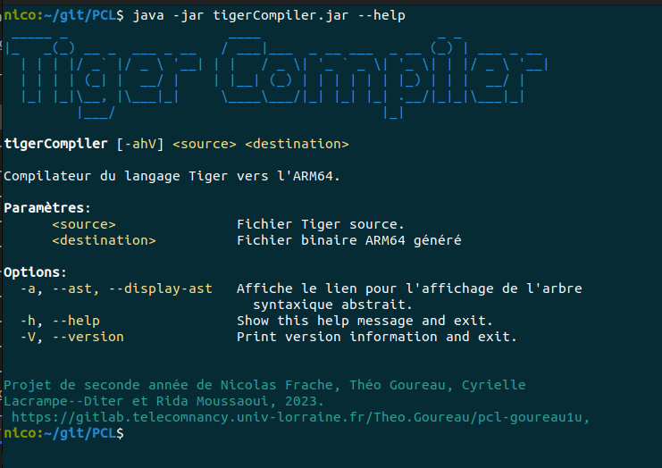

[](https://git.io/typing-svg)

---

# pcl-goureau1u

Projet de Compilation 2022-2023 (PCL1 & PCL2).
Membres du groupe :
- Nicolas Frache (IL)
- Théo Goureau (IL)
- Cyrielle Lacrampe--Diter (IL)
- Rida Moussaoui (ISS)

---
# Technologies utilisées

- Compilateur écrit en **Java** avec un projet **Maven**
- Analyseur LL(*) pour notre grammaire LL1 :  **Antlr4** 
- Langage de destination : **Arm64**

---
# Utilisation de l'application
- Cloner le dépot git
- Executer le fichier [./tigerCompiler.jar]() avec :
``` shell
java -jar ./tigerCompiler.jar
```
Voir la syntaxe:



# MAVEN
## Utilisation de Maven
### Installer Maven
_Ubuntu_ : ```sudo apt install Maven```

_Windows_ : https://maven.apache.org/install.html#windows-tips
    
    ▶️ Ou utiliser les packages et extension MAVEN d'un IDE (beaucoup plus pratiques)

---
### Se déplacer dans le bon projet
```antlrv4
cd AntlrMavenProject/chaoscompiler/
```
---

### Utiliser les goals

- Nettoyer le projet

``` antlrv4
mvn clean
```

--- 
- Générer le lexer et le parser puis compiler

``` antlrv4
mvn compile
```

Pour génerer le lexer et le parser **sans** compiler le projet, on peut aussi faire:

``` antlrv4
mvn antlr4:antlr4
```

---

- lance les tests (grace au plugin *surefire*) + tâches précèdentes si nécessaires
``` antlrv4
mvn test
```
---
### Execution du main
Deux solution:
1. Executer le main manuellement avec gradle

``` antlrv4
mvn install
```
``` antlrv4
mvn exec:java -Dexec.mainClass=eu.tn.chaoscompiler.main.Main -Dexec.args="./src/test/ressources/correct/01_test [--ast]"
```
---
2. L'application peut également générer un fatjar totalement indépendant avec le *maven-assembly-plugin*, le jar est situé dans le dossier target.
``` antlrv4
mvn package
```
``` antlrv4
java -jar .\target\chaoscompiler-1.0-SNAPSHOT-jar-with-dependencies.jar ./src/test/ressources/correct/01_test [--ast]
``` 

```

Qu'on peut adapter si besoin en fonction des versions de java, par exemple ;
``` antlrv4
C:\Users\USER\.jdks\openjdk-19\bin\java.exe -jar ...

```

### Problèmes possibles

En cas de soucis avec la version de java, essayer de modifier la version de java utilisé par le plugin de de compilation (*maven-compiler-plugin*) de maven dans le fichier *pom.xml*.

Il faut changer les lignes suivantes en remplacant ``19`` par ``1.8`` par exemple :
``` xml
<configuration>
    <source>19</source>
    <target>19</target>
</configuration>
```


